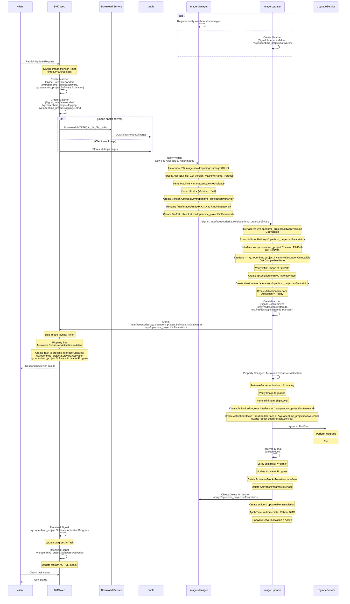

# Current Code Update Flow

```mermaid
sequenceDiagram;
participant CL as client
participant BMCW as BMCWeb
participant DWNLD as Download Service
participant TMPFS as tmpfs
participant IMGM as Image Manager
participant IMGU as Image Updater
participant UPGS as UpgradeService

par
IMGM ->> IMGM: Register Notify watch for /tmp/images
and
IMGU ->> IMGU: Create Matcher<br>(Signal, InterfacesAdded, <br> "/xyz/openbmc_project/software")
end

CL ->> BMCW: Redfish Update Request

note over BMCW: START Image Monitor Timer<br> timeout=600/25 secs
BMCW ->> BMCW: Create Matcher <br>(Signal, InterfacesAdded,<br> /xyz/openbmc_project/software, <br> xyz.openbmc_project.Software.Activation)
BMCW ->> BMCW: Create Matcher <br>(Signal, InterfacesAdded,<br> /xyz/openbmc_project/logging, <br> xyz.openbmc_project.Logging.Entry)

alt Image on tftp server
BMCW ->> DWNLD: DownloadViaTFTP(tftp_fw_file_path)
DWNLD ->> TMPFS: Downloads to /tmp/images
else Client sent Image
BMCW ->> TMPFS: Stores at /tmp/images 
end

TMPFS ->> IMGM: Notify Watch:<br> New File Available at /tmp/images
note over IMGM: Untar new FW image into /tmp/images/imageXXXXX 
note over IMGM:  Parse MANIFEST file: Get Version, Machine Name, Purpose
note over IMGM: Verify Machine Name against /etc/os-release
note over IMGM: Generate id = (Version + Salt)
note over IMGM: Create Version Object at  /xyz/openbmc_project/software/<id>
note over IMGM: Rename /tmp/images/imageXXXXX to /tmp/images/<id>
note over IMGM: Create FilePath object at /xyz/openbmc_project/software/<id>

IMGM ->> IMGU: Signal : InterfacesAdded at /xyz/openbmc_project/software
note over IMGU: Interface == xyz.openbmc_project.Software.Version <br> Get version
note over IMGU: Extract Id from Path /xyz/openbmc_project/software/<id>
note over IMGU: Interface == xyz.openbmc_project.Common.FilePath <br> Get FilePath
note over IMGU: Interface == xyz.openbmc_project.Inventory.Decorator.Compatible <br> Get CompatibleName
note over IMGU: Verify BMC Image at FilePath
note over IMGU: Create association to BMC Inventory Item
note over IMGU: Create Version Interface at /xyz/openbmc_project/software/<id>
note over IMGU: Create Activation Interface<br> Activation = Ready
IMGU ->> IMGU: CreateMatcher:<br> (Signal, JobRemoved,<br> /org/freedesktop/systemd1,<br> org.freedesktop.systemd1.Manager)

IMGU ->> BMCW : Signal: <br>InterfacesAdded(xyz.openbmc_project.Software.Activation) at<br> /xyz/openbmc_project/software/<id>
note over BMCW: Stop Image Monitor Timer
note over BMCW: Property Set<br>Activation.RequestedActivation  = Active
note over BMCW: Create Task to process Interface Updates:<br> xyz.openbmc_project.Software.Activation<br> xyz.openbmc_project.Software.ActivationProgress

BMCW -->> CL: Respond back with TaskId

IMGU ->> IMGU: Property Changed: Activation.RequestedActivation
note over IMGU: SoftwareServer.activation = Activating
note over IMGU: Verify Image Signature
note over IMGU: Verify Minimum Ship Level
note over IMGU: Create ActivationProgress Interface at /xyz/openbmc_project/software/<id>
note over IMGU: Create ActivationBlocksTransition Interface at /xyz/openbmc_project/software/<id> <br> (Starts reboot-guard-enable.service)
IMGU ->> UPGS: systemd UnitStart

note over UPGS: Perform Upgrade
note over UPGS: Exit

IMGU ->> IMGU: Received Signal:<br> JobRemoved
note over IMGU: Verify JobResult = "done"
note over IMGU: Update ActivationProgress
note over IMGU: Delete ActivationBlocksTransition Interface
note over IMGU: Delete ActivationProgress Interface
IMGU ->> IMGM: Object.Delete for Version<br> at /xyz/openbmc_project/software/<id>
note over IMGU: Create active & updateable association.
note over IMGU: ApplyTime == Immediate, Reboot BMC
note over IMGU: SoftwareServer.activation = Active

BMCW ->> BMCW: Received Signal:<br> xyz.openbmc_project.Software.ActivationProgress
note over BMCW: Update progress in Task

BMCW ->> BMCW: Received Signal:<br> xyz.openbmc_project.Software.Activation
note over BMCW: Update status=ACTIVE in task

CL ->> BMCW: Check task status
BMCW -->> CL: Task Status
```
