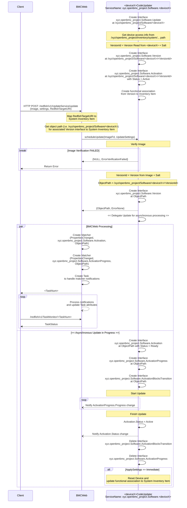

# Proposed Code Update Flow

```mermaid
sequenceDiagram;
participant CL as Client
participant BMCW as BMCWeb
participant CU as <deviceX>CodeUpdater<br> ServiceName: xyz.openbmc_project.Software.<deviceX>

% Bootstrap Action for CodeUpdater
CU ->> CU: Create Interface<br> xyz.openbmc_project.Software.Update<br> at /xyz/openbmc_project/Software/<deviceX>
note over CU: Get device access info from<br> /xyz/openbmc_project/inventory/system/... path
note over CU: VersionId = Version Read from <deviceX> + Salt
CU ->> CU: Create Interface<br> xyz.openbmc_project.Software.Version<br> at /xyz/openbmc_project/Software/<deviceX>/<VersionId>
CU ->> CU: Create Interface<br>xyz.openbmc_project.Software.Activation<br> at /xyz/openbmc_project/Software/<deviceX>/<VersionId> <br> with Status = Active
CU ->> CU: Create functional association <br> from Version to Inventory Item

CL ->> BMCW: HTTP POST: /redfish/v1/UpdateService/update <br> (Image, settings, RedfishTargetURI)
note over BMCW: Map RedfishTargetURI to<br> System Inventory Item
note over BMCW: Get object path (i.e. /xyz/openbmc_project/Software/<deviceX>)<br>for associated Version interface to System Inventory Item
BMCW ->> CU: scheduleUpdate(ImageFd, UpdateSettings)

note over CU: Verify Image
break Image Verification FAILED
    CU -->> BMCW: {NULL, ErrorVerificationFailed}
    BMCW -->> CL: Return Error
end
note over CU: VersionId = Version from Image + Salt
note over CU: ObjectPath = /xyz/openbmc_project/Software/<deviceX>/<VersionId>
CU ->> CU: Create Interface<br> xyz.openbmc_project.Software.Version<br> at ObjectPath
CU -->> BMCW: {ObjectPath, ErrorNone}
CU ->> CU: << Delegate Update for asynchronous processing >>

par BMCWeb Processing
    BMCW ->> BMCW: Create Matcher<br>(PropertiesChanged,<br> xyz.openbmc_project.Software.Activation,<br> ObjectPath)
    BMCW ->> BMCW: Create Matcher<br>(PropertiesChanged,<br> xyz.openbmc_project.Software.ActivationProgress,<br> ObjectPath)
    BMCW ->> BMCW: Create Task<br> to handle matcher notifications
    BMCW -->> CL: <TaskNum>
    loop
        BMCW --) BMCW: Process notifications<br> and update Task attributes
        CL ->> BMCW: /redfish/v1/TaskMonitor/<TaskNum>
        BMCW -->>CL: TaskStatus
    end
and << Asynchronous Update in Progress >>
    CU ->> CU: Create Interface<br>xyz.openbmc_project.Software.Activation<br> at ObjectPath with Status = Ready
    CU ->> CU: Create Interface<br>xyz.openbmc_project.Software.ActivationProgress<br> at ObjectPath
    CU ->> CU: Create Interface<br> xyz.openbmc_project.Software.ActivationBlocksTransition<br> at ObjectPath
    note over CU: Start Update
    loop
        CU --) BMCW: Notify ActivationProgress.Progress change
    end
    note over CU: Finish Update
    CU ->> CU: Activation.Status = Active
    CU --) BMCW: Notify Activation.Status change
    CU ->> CU: Delete Interface<br> xyz.openbmc_project.Software.ActivationBlocksTransition
    CU ->> CU: Delete Interface<br> xyz.openbmc_project.Software.ActivationProgress
    alt ApplySettings == Immediate
        note over CU: Reset Device and<br> update functional association to System Inventory Item
    end
end
```
